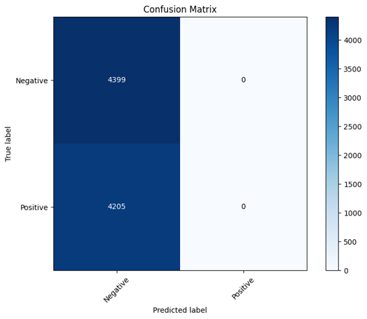
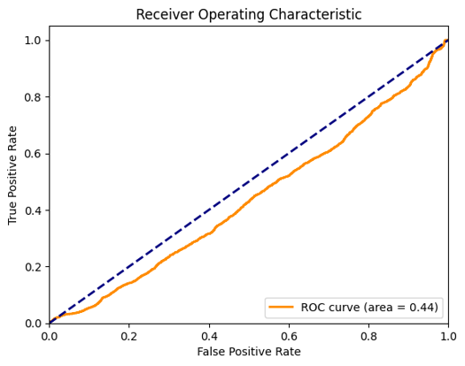
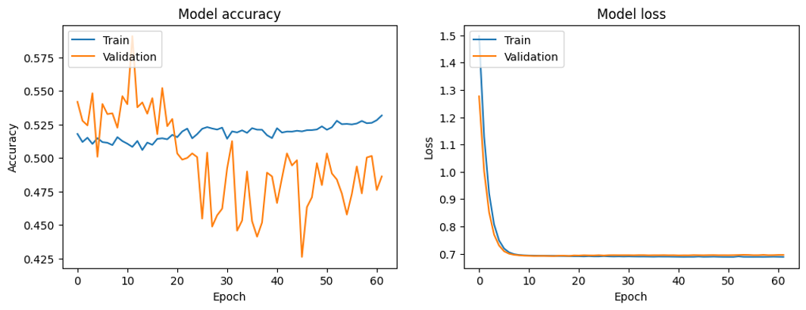

# Bitcoin Price Direction Prediction with Deep Learning

**Forecasting One Hour Ahead using Bidirectional LSTM + GRU**

Predicting the direction (up/down) of Bitcoin prices using deep learning on time-series data.  
Built with a hybrid BiLSTM + BiGRU model trained on real BTC/USDT data from Binance.

---

## 📌 Project Overview

This project focuses on predicting whether the price of Bitcoin will increase or decrease in the next 60 minutes, using historical trading data and deep learning models.  
With the extreme volatility of the cryptocurrency market, short-term forecasting can provide valuable insights for investors and traders.

---

## 🧠 Model Architecture

The model combines the strengths of Bidirectional LSTM and Bidirectional GRU layers:

- **BiLSTM** captures temporal dependencies in both forward and backward directions.
- **BiGRU** offers a lighter architecture for pattern recognition.
- **Dense Layers** interpret features using ReLU and sigmoid activations.

This layered architecture helps extract meaningful signals from noisy, fast-moving financial data.

---

## 💾 Dataset Details

- **Source**: 1-minute interval BTC/USDT data from Binance (CSV file)
- **Features Used**:
  - Open, High, Low, Close prices
  - Volume, Quote Volume, Taker Buy Volume
  - Number of trades
  - Engineered features like 7-day and 30-day moving averages, return values
- **Preprocessing**:
  - Handled missing values (filled with 0)
  - Generated technical indicators

> Various historical window sizes (5y, 1y, 6m, 3m, 1m) were tested, but 1-month data was selected due to similar performance across all.

---

## ⚙️ Technologies Used

- Python 3.x  
- TensorFlow & Keras  
- Pandas & NumPy  
- Matplotlib & Seaborn  
- Scikit-learn  
- Google Colab  

---

## 🎯 Model Performance

| Metric             | Value    |
|--------------------|----------|
| Accuracy           | 51.13%   |
| Model Type         | Binary Classification |
| Loss Function      | Binary Crossentropy |
| Optimizer          | Adam     |

> Crypto market volatility makes prediction challenging, but the model reveals subtle and learnable signals.

---

## 📊 Evaluation & Visualizations

### 📌 Confusion Matrix
Shows how the model classified each class:



---

### 📌 ROC Curve
Visualizes classification ability. AUC = 0.44 indicates the model struggles to perform better than random guessing.


---

### 📌 Accuracy & Loss Over Epochs
Displays how training and validation metrics evolved over epochs.




## 🚀 How to Run This Project

Follow these steps to run the notebook in Google Colab:

1. **Clone the repository**
   ```bash
   git clone https://github.com/edaaydemir/BitcoinPricePrediction
   ```
 2. Open the notebook
Open 'BitcoinPrediction.ipynb' in Google Colab

 3. Upload Dataset
Use `BTCUSDT-1m-2020-09.csv` from Binance or your local copy

 4. Run all cells to preprocess, train, evaluate, and visualize

👥 Authors
Eda AYDEMİR and Zuhal ÖZER
Eskişehir Technical University – Deep Learning Course Project

📝 Disclaimer :
This model was built for academic research. It is not financial advice.
Use responsibly and validate thoroughly before applying in real-world scenarios.
